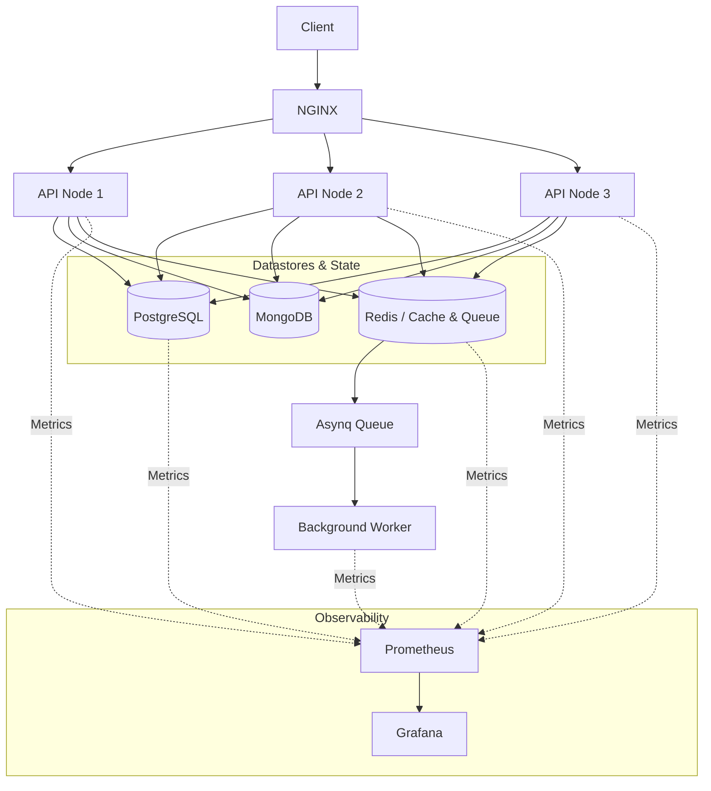

# EMC LB (EMC Load Balancer API)

EMC LB là một hệ thống backend e-commerce được xây dựng bằng Go, được thiết kế theo kiến trúc multi-node. Dự án tập trung vào việc xây dựng và nghiên cứu một backend có khả năng xử lý tải cao, quản lý state phân tán, background processing và observability toàn diện.

Dự án cung cấp một bộ khung (scaffold) mạnh mẽ kết hợp giữa cơ sở dữ liệu quan hệ (PostgreSQL), phi quan hệ (MongoDB), caching/queue (Redis), background worker (Asynq) và hệ thống giám sát (monitoring) đầy đủ.

## 🎯 Project này giải quyết bài toán gì?

Mặc dù có tên là "EMC LB", Go application không tự làm load balancing. NGINX đóng vai trò là Load Balancer phân tải traffic xuống các Go API nodes. 

Project này mô phỏng và giải quyết các bài toán kỹ thuật thực tế của một hệ thống thương mại điện tử (e-commerce) quy mô lớn:
- **Quản lý đa dạng dữ liệu:** Kết hợp linh hoạt giữa Relational DB (Users, RBAC) và Document DB (Products, Orders, Carts, Categories) để tối ưu hóa truy vấn và lưu trữ.
- **Xử lý đồng thời (Concurrency):** Xử lý an toàn các thao tác nhạy cảm như trừ kho (atomic updates) dưới áp lực tải cao.
- **Offload tác vụ nặng:** Sử dụng background worker để xử lý các tác vụ không cần phản hồi ngay (như gửi email) giúp API response nhanh hơn.
- **Khả năng quan sát (Observability):** Theo dõi sức khỏe của từng node, database và server thông qua hệ thống monitoring chuyên dụng.

## 🏗 Kiến trúc hệ thống (Architecture)

### 1. Multi-node Architecture & Load Balancing

Hệ thống sử dụng kiến trúc multi-node để đảm bảo **horizontal scaling**, **high availability**, và **load distribution**. 

- **NGINX** hoạt động như một Reverse Proxy & Load Balancer. Nó phân phối traffic từ Client đến 3 API instances theo thuật toán Round Robin.
- **3 API Nodes** (`emc_api_node_1`, `2`, `3`) hoạt động độc lập, không trạng thái (stateless), chia sẻ chung các datastores (PostgreSQL, MongoDB, Redis). Nếu một node chết, NGINX sẽ tự động failover sang các node còn lại (cấu hình `max_fails=3`).

### 2. Request Flow



### 3. Asynchronous Worker Flow

Ứng dụng sử dụng **Asynq** (được back bởi Redis) để xử lý các background jobs.

1. **API Node** nhận request (ví dụ: đăng ký user).
2. API Node đẩy một task (ví dụ: `send_welcome_email`) vào Asynq Queue trên Redis và trả về response cho client ngay lập tức.
3. **Worker Node** (`emc_worker` chạy độc lập) liên tục poll Redis, lấy task ra và xử lý (gọi external mail service).

### 4. Data Architecture

| Component | Role trong hệ thống |
|---|---|
| **PostgreSQL** | Lưu trữ dữ liệu quan hệ, cấu trúc chặt chẽ (Users, Authentication, RBAC). Tương tác qua `sqlc`. |
| **MongoDB** | Lưu trữ dữ liệu e-commerce dạng document (Products, Categories, Orders, Carts, Coupons, Brands, Shops). Tối ưu cho catalog và dữ liệu linh hoạt. |
| **Redis** | Caching dữ liệu để tăng tốc độ phản hồi và làm Message Broker cho Asynq worker. |
| **LocalStack** | Giả lập các dịch vụ AWS (như S3 lưu trữ avatar/ảnh, SES) cho môi trường local. |

### 5. Observability (Monitoring)

Hệ thống được thiết kế với khả năng quan sát (observability) toàn diện:
- **Prometheus:** Server trung tâm thu thập (scrape) metrics từ các thành phần hệ thống.
- **Grafana:** Dashboard trực quan hóa dữ liệu từ Prometheus.
- **Telegraf:** Thu thập metrics của host/Docker container.
- **Node Exporter:** Expose metrics của phần cứng và hệ điều hành (CPU, RAM, Disk).
- **Postgres/Redis Exporter:** Expose metrics chuyên sâu về hiệu năng và trạng thái của cơ sở dữ liệu.

## 🚀 Technology Stack

### Backend
- **Go 1.25** & **Gin Framework**

### Databases & Cache
- **PostgreSQL 15** (managed via `sqlc` & `golang-migrate`)
- **MongoDB 7** (multi-document transactions enabled via single-node replica set)
- **Redis 7**

### Queue & Background Processing
- **Asynq** (Redis-based task queue)

### Infrastructure & Load Balancing
- **Docker Compose**
- **NGINX**
- **LocalStack** (AWS Emulation)

### Observability
- **Prometheus**, **Grafana**, **Telegraf**, **Node Exporter**, **Postgres/Redis Exporters**

### Development Tools
- **Air** (Live reload), **Swag** (Swagger docs), **Mockery**, **golangci-lint**

## 🛠 Hướng dẫn chạy dự án (Getting Started)

### Yêu cầu hệ thống
- [Docker](https://www.docker.com/) và [Docker Compose](https://docs.docker.com/compose/)
- [Go](https://go.dev/dl/) 1.25+
- [Make](https://www.gnu.org/software/make/)

### Các bước khởi chạy

1. **Chuẩn bị môi trường:**
   Copy file môi trường mẫu:
   ```bash
   cp .env.example .env.development
   ```

2. **Khởi động hạ tầng (Databases, Redis, LocalStack, Monitoring):**
   ```bash
   make docker-up
   ```
   *(Lưu ý: MongoDB được cấu hình tự động khởi tạo Replica Set ở lần chạy đầu tiên để hỗ trợ transactions).*

3. **Khởi chạy ứng dụng (Môi trường Dev với Live-reload):**
   ```bash
   make dev
   ```
   *Lệnh này sẽ chạy Go API server trực tiếp trên host bằng `air`.*

4. **Chạy toàn bộ hệ thống bằng Docker (Bao gồm NGINX, 3 API Nodes, Worker):**
   ```bash
   make deploy
   ```

5. **Tài liệu API (Swagger):**
   Tạo docs mới nhất:
   ```bash
   make swag
   ```
   Sau khi API chạy, truy cập Swagger UI: `http://localhost:8080/swagger/index.html`

## 🧰 Các lệnh Makefile hữu ích

- `make dev`: Chạy API local với `air` (tự động reload).
- `make deploy`: Build và khởi chạy toàn bộ kiến trúc phân tán (NGINX, 3 API nodes, Worker, DBs, Monitoring) bằng Docker.
- `make docker-up`: Chỉ khởi động các container hạ tầng.
- `make docker-down`: Dừng toàn bộ container.
- `make sqlc`: Generate Go code từ các file `.sql` (dành cho PostgreSQL).
- `make migrate-up` / `make migrate-down`: Chạy database migrations.
- `make test`: Chạy unit tests.
- `make lint`: Chạy `golangci-lint`.
